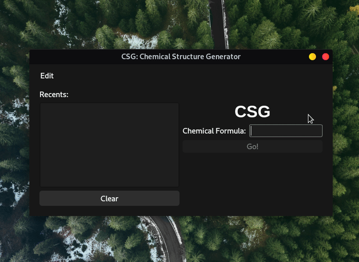

# CSG: Chemical Structure Generator


<br/>
<br/>
A simple Chemical Structure Generator.

## Requirements

- Python 3 (>= v3.8)
- PyQt5 (optional; >= v5.15.0 required for graphical front-end)
- Matplotlib (>= v3.3.1)

## Install Dependencies

Change to the source directory and type the following command:

```
pip install -r requirements.txt
```

### Workaround for macOS Big Sur on the Apple M1 chip

The required version of PyQt5 cannot be installed using pip on M1 MacBooks
(tested on the MacBook Air) as of the time of writing. A workaround for this is
as follows:

- Install [Homebrew](https://brew.sh).
- Run the following commands for PyQt5 v5.15.4 running on Python 3.9 (replace
  versions in the command appropriately):

  ```
  brew install pyqt5
  mv /opt/homebrew/Cellar/pyqt@5/5.15.4_2/lib/python3.9/site-packages/* /Library/Frameworks/Python.framework/Versions/3.9/lib/python3.9/site-packages/
  ```
- Install matplotlib using pip:

  ```
  pip3 install matplotlib
  ```
- Run CSG:

  ```
  ./csg.py
  ```

## Usage

```
Usage: csg.py [OPTION]
    Generate simple chemical structures.

Options:
    --cli           Run in the terminal
    --help,   -h    Show this help message and exit
    --version -V    Show version information and exit
```

## License

Copyright © 2020-2021 Jithin Renji, Kannan MD, Pranav Pujar

CSG is free software: you can redistribute it and/or modify
it under the terms of the GNU General Public License as published by
the Free Software Foundation, either version 3 of the License, or
(at your option) any later version.

CSG is distributed in the hope that it will be useful,
but WITHOUT ANY WARRANTY; without even the implied warranty of
MERCHANTABILITY or FITNESS FOR A PARTICULAR PURPOSE.  See the
GNU General Public License for more details.
You should have received a copy of the GNU General Public License
along with CSG.  If not, see <https://www.gnu.org/licenses/>.
